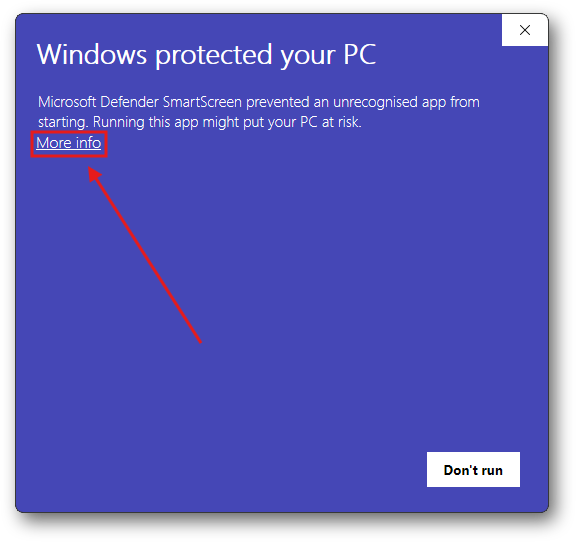
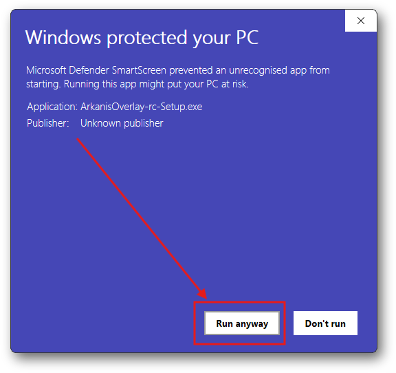

<h1 align="center">
<a href="https://arkanis.cc/overlay" target="_blank">Arkanis Overlay</a>
for Star Citizen
</h1>

<h3 align="center">
A Next-Generation Overlay Companion for Star Citizen 
</h3>

<h6 align="center">
Created by <a href="https://discord.com/users/174617873182883841" target="_blank"><b>FatalMerlin</b></a>,
co-founder of the <a href="https://org.arkanis.cc" target="_blank">in-game organization</a> <a href="https://arkanis.cc" target="_blank"><b>Arkanis Corporation</b></a>,
 and <a href="https://discord.com/users/224580858432978944" target="_blank"><b>TheKronnY</b></a>, <a href="https://i.redd.it/dkrdm5jdb8ce1.jpeg" target="_blank">an engineer and IT PhD student</a>.
</h6>

<h6 align="center">

</h6>

https://github.com/user-attachments/assets/f932f4c3-913c-4064-9174-566f0e755046

---

## 🚀 What is Arkanis Overlay?

**Arkanis Overlay** is a usability-focused, in-game companion overlay for **Star Citizen**.
It aims to provide players with direct access to essential tools and information without having to leave the game or juggle external websites.
Inspired by the *[RatScanner](https://ratscanner.com/)* project from the Tarkov community,
this project is built with a strong focus on reliability, extensibility, and community collaboration.

The overlay is currently in **active development** and driven by a clear mission:
> **Minimize friction, maximize immersion.**

---

## ✨ Key User Features (MVP)

- **In-Game Search Tool**
  — Find general and commonly-needed game information fast — no more alt-tabbing to search websites.

- **Integrated Community Data**
  — Seamlessly connected with the [UEX Corporation][uex] and other community tools _(in the future)_
  to enrich in-game decision-making.

- **Automatic Startup**
  — Launches automatically when you start Windows and Star Citizen, so you’re always ready to go.

- **Installer & Auto-updater**
  — A self-updating installer that ensures you always have the latest version of the overlay.

## 🤝 Community Focus

- **Community-Driven Development**
  — Built in collaboration with players and devs who actively use and shape the tools.

- **Open Source**
  — The project is open source, allowing anyone to contribute, suggest features, and report bugs.
  We welcome all contributions, whether big or small.
  Check out the [contributing guidelines](CONTRIBUTING.md) for more information on how to get involved
  and let us know you are up for the challenge by joining our [Discord server][arkanis-discord]
  or opening [a new discussion on GitHub](https://github.com/ArkanisCorporation/ArkanisOverlay/discussions/categories/ideas).

## 🖥️ Tech Stack

- Microsoft **.NET 8**
  — The application is built using the latest .NET technologies, ensuring a modern and efficient (developer) experience.

- **WPF-Hosted Blazor Windows App**
  — Built in C# using modern UI technologies for smooth performance and simple extensibility.

- **ASP.NET Core Server**
  — The backend is built on ASP.NET Core, providing a robust and scalable foundation for future features.

---

> [!TIP]
> You can check out the in-browser demo of the overlay at [overlay.arkanis.cc][overlay-demo]!
> It features an identical UI and functionality as the in-game version, just without the game integration.

## 🛠️ Getting Started

This section provides a quick overview of how to install and use the Arkanis Overlay application.

### Installation

Follow these steps to install the Arkanis Overlay application on your Windows system:

1. **Download** an installer for the latest (stable) release from:
    - the [Overlay in-browser demo page][overlay-demo]
    - or the [Arkanis Overlay homepage][overlay-homepage]
    - or the [GitHub releases page](https://github.com/ArkanisCorporation/ArkanisOverlay/releases)
2. **Run the installer** to automatically install the application with a self-updater.
    Windows may prompt you with a UAC (User Account Control) dialog to confirm the installation.
   This is a standard security feature of Windows to ensure that you trust the application you are installing.
   See the screenshots below for reference.
   After confirming, the application will be installed to `%LocalAppData%/ArkanisOverlay`.

   |             Installer - Windows UAC Step 1              |             Installer - Windows UAC Step 2              |
               |:-------------------------------------------------------:|:-------------------------------------------------------:|
   |  |  |

3. **Launch the application** from the Start Menu or by double-clicking the desktop shortcut.
   Both are named `Arkanis Overlay`.

### Application Behavior

Once launched, the application runs in the **Windows system tray**.
It does not display a window by default.
From the tray icon, you can open the **preferences dialog** or exit the application entirely.

### Overlay Activation

> [!IMPORTANT]
> The in-game overlay can be opened using the default keyboard shortcut: `Left Alt + Left Shift + S`.

The shortcut can be customized through the **preferences dialog**, allowing you to set a key combination that best suits your needs.

### Preferences and Configuration

The preferences dialog is accessible either from the **system tray icon** or directly within the **overlay interface** itself.

Within the preferences dialog, you currently can:

- Enable or disable automatic launching of the application when Windows starts.
- Choose whether the overlay application should automatically exit when Star Citizen is closed.
- Customize the keyboard shortcut used to activate the overlay.
- Adjust other application-specific settings related to appearance and behavior.

---

## 🔮 Roadmap & Planned Features

We're dreaming big — here's what's ahead:

### 🧩 Core Enhancements

- [x] Seamless self-updater and installer
- [x] Keyboard shortcuts for quick access and navigation within the overlay
- [ ] Improved reliability and usability
- [ ] Configurable display: layouts, themes, behavior
- [ ] Localization

### 🔎 Smarter Search

- [x] Full-text search across entity database (commodities, locations, items, etc.)
- [ ] Improvements to fuzzy search and result ranking]

### 🔗 Integrations & Tools

- [x] Game entity search sourced from [UEX Corporation][uex]
- [ ] [UEX CLI](https://github.com/UEXCorp/UEX-CLI) and MFD screen integration
- [ ] Embedded tools and services _(permissions required)_
    - [ ] [SPViewer](https://www.spviewer.eu/)
    - [ ] [Erkul](https://www.erkul.games/)
    - [ ] [Regolith Co.](https://regolith.rocks/)
    - and more...
- [ ] API-driven data enrichment from the community (Wiki, JSON exports, etc.)
- [ ] Additional social features (Discord, orgs, etc.)

### 🔍 OCR-Driven Intelligence

- [ ] UEX data extraction (prices for commodities, items, fuel, ores, etc.)
- [ ] [Regolith Co.](https://regolith.rocks/) integration
- [ ] Player location-based map awareness and contextual recommendations

### 🧭 Long-Term Vision

- Gameplay enhancement tools:
    - Task & progress tracking
    - Party, session, squad, and advanced org management utilities
    - Inventory management
    - Note-taking & planning aids
- **Plugin support** for third-party extensions _(exploration stage)_

> [!NOTE]
> Do you have other ideas for features or tools you'd like to see integrated into the overlay?
> We're all ears!
> Open up [a new discussion on GitHub](https://github.com/ArkanisCorporation/ArkanisOverlay/discussions/categories/ideas), and let's make it happen.
> Together.

---

## 💡 Philosophy

Star Citizen is vast — and at times, frustratingly so.
Especially for citizens newly embarking on their journey in Stanton and beyond.
**Arkanis Overlay** doesn't aim to change the game, but to make the *experience better*.
For everyone.
It’s your always-on wingman — helpful, seamless, and never in the way.

Key principles:

- **Reliable UX**: The overlay *must* be stable. The game has enough bugs already.
- **Incremental growth**: Release early, improve often.
- **No exploits**: This project will *never* include cheats, automation, or game-breaking features.

---

## 🧑‍💻 Development Status

> Project Lead: [FatalMerlin](https://github.com/FatalMerlin) 
> Language: C# 
> Frameworks: **WPF** and **WebView2** for the Windows client, **Blazor**

Currently developed in bursts due to time constraints (because, you know… real life).
We are now a small dev team — progress is slow but deliberate.
We are looking for fellow motivated and able citizens to join us on this journey.

> [!NOTE]
> Have you found a bug?
> Would you like contribute to the project?
> We are always looking for help with feature development, application testing, and better UI/UX design.
> Open [a new discussion](https://github.com/ArkanisCorporation/ArkanisOverlay/discussions/categories/ideas),
> [an issue](https://github.com/ArkanisCorporation/ArkanisOverlay/issues/new/choose)
> or contact [@FatalMerlin](https://discord.com/users/174617873182883841) directly.
> We'd love your input!

---

## 🙌 Community & Support

Big shout-out to:

- **UEX Dev Team** for their continued support, testing, and our future collaboration.
- Everyone in the **Arkanis Corporation** and broader Star Citizen community who has provided feedback and ideas.

---

## 🧭 Why "Arkanis"?

The name pays tribute to the **Arkanis Sector**, a frontier region of bold explorers
— just like the developers and the users of this tool.
We aim to embody the same spirit: discovery, utility, and frontier innovation.

---

## 📜 License

This project is licensed under the PolyForm Noncommercial License 1.0.0.

In simple terms:

- You can use, modify, and share this software freely for noncommercial purposes.
- You cannot use this software <u>for commercial purposes</u>.
  That includes selling it, using it in a business, or any activity intended for commercial advantage or monetary compensation.

See the [LICENSE.md](LICENSE.md) file for the full text of the license.

---

## 🌌 Final Words

This is only the beginning.
**Arkanis Overlay** is designed to grow with the game and the community.
Let’s make Star Citizen a little smoother — together.

> *“A ship is only as good as its crew.”*
> — Unknown

---

[overlay-demo]: https://overlay.arkanis.cc
[overlay-homepage]: https://arkanis.cc/overlay
[arkanis-discord]: https://join.arkanis.cc
[uex]: https://uexcorp.space
